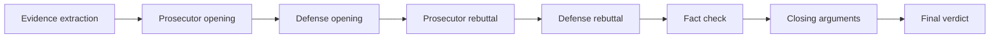

# Architecture

## Flow (sequential crew)

| Agent | Role |
|--------|------|
| Evidence analyst | Neutral fact extraction from case documents |
| Prosecutor | Argues **for** the motion |
| Defense | Argues **against** the motion |
| Fact checker | Flags weak or inconsistent claims |
| Judge | Scores both sides and selects a winner |

Task outputs are written as JSON under `outputs/` (see `config/tasks.yaml`).

## Entry points

| Command | Purpose |
|---------|---------|
| `uv run debate_engine` or `python -m debate_engine.main` | Run default case |
| `python -m debate_engine.main run <case>` | Run case 1–4 |
| `python -m debate_engine.main rankings` | Print historical rankings from `debate_results.json` |
| `uv run debate_leaderboard` | Gradio UI over `debate_results.json` |

## Configuration

- **Agents / tasks:** `src/debate_engine/config/agents.yaml`, `tasks.yaml`
- **Models:** LiteLLM-compatible IDs; pool and per-role overrides via environment variables (`DEBATE_*_MODEL`, provider API keys).

## Stack

- [CrewAI](https://docs.crewai.com/) sequential `Crew`
- [Gradio](https://gradio.app/) leaderboard (optional)
