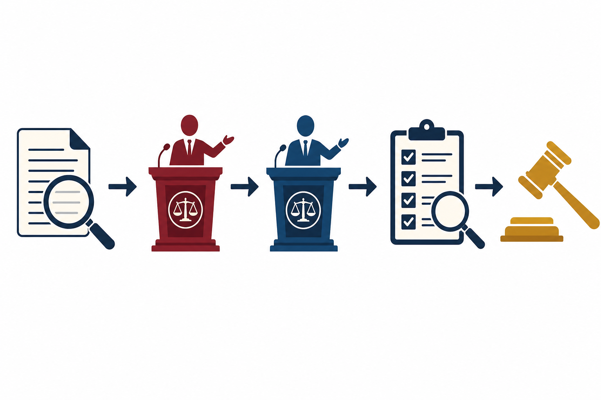

# CrewAI Debate Engine

[](https://www.python.org/)
[](LICENSE)
[](https://github.com/crewAIInc/crewAI)

<p align="center">
  
</p>

A **multi-agent courtroom debate** demo built with **CrewAI**. Five roles—**evidence analyst**, **prosecutor**, **defense**, **fact checker**, and **judge**—run in a **sequential** pipeline over synthetic legal-style case briefs. Each stage writes **structured JSON** under `outputs/`; the judge produces **scores**, a **winner**, and **reasoning**. A small **Gradio leaderboard** reads cumulative results from `debate_results.json`.

---

## What it does

<p align="center">
  
</p>

- **Cases 1–4:** Preloaded motions (AI hiring discrimination, copyright, autonomous vehicle liability, content moderation).
- **Model selection:** Prosecutor and defense can be sampled from a pool of configured LiteLLM models (default: OpenAI IDs such as `gpt-4o-mini` when `OPENAI_API_KEY` is set). Judge, evidence analyst, and fact checker use configurable defaults.
- **Leaderboard:** After a run, `display_leaderboard` appends to `outputs/debate_results.json`. `debate_leaderboard` serves a themed Gradio UI.

Design detail: [ARCHITECTURE.md](ARCHITECTURE.md).

---

## Requirements

- Python **3.10–3.13** (aligned with CrewAI constraint in `pyproject.toml`)
- API keys for chosen LLM providers (see `.env.example`)

---

## Setup

Install with [uv](https://docs.astral.sh/uv/) (recommended):

```bash
# From the cloned repository root:
uv sync
cp .env.example .env   # Windows: copy .env.example .env
# Edit .env — at minimum OPENAI_API_KEY for default pools
```

Alternatively:

```bash
pip install -e ".[dev]"
```

---

## Run a debate

From the project root (working directory matters for `outputs/` paths):

```bash
uv run python -m debate_engine.main run 1
```

Other cases: `run 2`, `run 3`, `run 4`.

Explicit models (examples):

```bash
uv run python -m debate_engine.main run 1 \
  --prosecutor-model gpt-4o-mini \
  --defense-model gpt-4o \
  --judge-model gpt-4o-mini
```

Show rankings without running a new debate:

```bash
uv run python -m debate_engine.main rankings
```

---

## Leaderboard UI

```bash
uv run debate_leaderboard
```

Opens Gradio locally (port from `GRADIO_SERVER_PORT` or auto-selected). Reads `outputs/debate_results.json`.

---

## Tests

Static checks only (no live LLM calls):

```bash
uv sync --extra dev
uv run pytest tests/ -v
```

---

## Security & cost

- Store keys in `.env` or the environment — never commit `.env`.
- Each full debate invokes **many** LLM calls; monitor provider billing and rate limits.

---

## License

[MIT](LICENSE)
